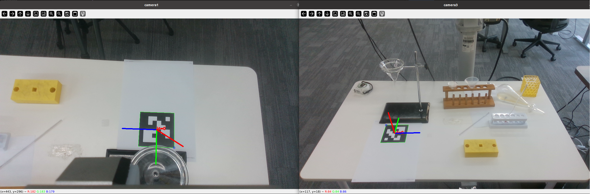

# 相机标定: 使用已标定好的camera1 (eye-in-hand) 来标定camera3 (fixed)

## 环境配置:

    sudo apt-get install ros-$ROS_DISTRO-realsense2-camera
    sudo apt-get install ros-noetic-realsense2-camera

    /bin/python3 -m pip install dm-env opencv-contrib-python spatialmath-python rospkg catkin_pkg numpy h5py ipython message_filters Cython pyrealsense2
    
    sudo mkdir -p /etc/apt/keyrings  # 注册公钥
    curl -sSf https://librealsense.intel.com/Debian/librealsense.pgp | sudo tee /etc/apt/keyrings/librealsense.pgp > /dev/null
    echo "deb [signed-by=/etc/apt/keyrings/librealsense.pgp] https://librealsense.intel.com/Debian/apt-repo $(lsb_release -cs) main" | sudo tee /etc/apt/sources.list.d/librealsense.list    # 添加源（Ubuntu 20.04 用 focal，22.04 用 jammy）
    sudo apt update
    sudo apt install librealsense2-utils

## 关键参数设置(根据实际情况调整):

1. data.json: 需要识别二维码的信息

2. transformations： T_ee_cam, camera1(eye-in-hand)的手眼标定矩阵

## 标定操作流程:

0. 放置 ArUco 标记 

        如(ID=0, 尺寸0.1m)，确保两个相机都能看到标记

1. 连接相机

        查看usb连接的 RealSense 相机
        rs-enumerate-devices

        启动camera1
        roslaunch realsense2_camera rs_camera.launch \
            camera:=camera1 \
            serial_no:=231522072272 \
            enable_color:=true \
            enable_depth:=true

        启动camera3
        roslaunch realsense2_camera rs_camera.launch \
            camera:=camera3 \
            serial_no:=250122078799 \
            enable_color:=true \
            enable_depth:=true

        查看camera1的节点是否成功发布，比如查看彩色图像的发布频率
        rostopic hz /camera1/color/image_raw

        查看camera3的节点是否成功发布，比如查看彩色图像的发布频率
        rostopic hz /camera3/color/image_raw

        note：
        不需要roscore, roslaunch 自动启动

2. 测试
        
        测试dobot连接是否正正常:
        /bin/python3  test_dobot.py

3. 运行主程序进行标定计算

        python show_image.py --camera1 camera1 --camera2 camera3 (暂时不用)

        /bin/python3   show_image.py --camera1 camera1 --camera2 camera3  (暂时不用)

        /bin/python3  marker_tracker.py 

        验证⚠️: 多次只移动marker位置，如果输出矩阵数值不变则标定正确。 或者移动camera1的位置？

4. 标定结果记录

        例子1：
        -0.08477   0.6161   -0.7831    0.7618    
        0.9132   -0.2663   -0.3084   -0.4537    
        -0.3985   -0.7413   -0.54      0.4132    
        0         0         0         1  

        -0.237     0.3968   -0.8868    0.9779    
        0.8981   -0.2585   -0.3557   -0.4309    
        -0.3704   -0.8808   -0.2951    0.3293    
        0         0         0         1     

        -0.226     0.6404   -0.734     0.9128    
        0.8513   -0.2364   -0.4684   -0.3642    
        -0.4736   -0.7307   -0.4917    0.5383    
        0         0         0         1  

        -0.2348    0.5554   -0.7978    0.9242    
        0.819    -0.329    -0.4701   -0.3433    
        -0.5235   -0.7638   -0.3776    0.521     
        0         0         0         1      

        -0.2351    0.5557   -0.7974    0.9239    
        0.8196   -0.3277   -0.47     -0.344     
        -0.5225   -0.764    -0.3784    0.5214    
        0         0         0         1      

        这两次相近，说明marker位置应该是稳定 

        -0.2121    0.6379   -0.7403    0.8831    
        0.8748   -0.2137   -0.4348   -0.3931    
        -0.4355   -0.7399   -0.5128    0.5042    
        0         0         0         1      

        
        -0.212     0.5602   -0.8008    0.9072    
        0.8865   -0.2347   -0.3989   -0.4237    
        -0.4114   -0.7944   -0.4469    0.4343    
        0         0         0         1         
        

        先分析是cam1还是cam3经常找不到， 然后再看它的marker pose的位置是不是对的？ 把存储的 和 show的位置数值进行对比?

        dobot pose 参与计算的pose应该就是对的？ get_pose已经可以验证?
        

5. 获取相机内参

        印出所有连接设备的内参详细信息
        rs-enumerate-devices -c

        获取相机实际使用的分辨率
        rostopic echo /camera3/color/image_raw --noarr -n1 | grep -E "height|width"
        比如：h 720 * w 1280
        rostopic echo /camera1/color/image_raw --noarr -n1 | grep -E "height|width"

        找到对应分辨率的内参参数
        注意是 Intrinsic of "Color"前缀的参数
        cam3_k:
        [907.5684,   0,       637.8553],
        [  0,      907.5656, 360.8097],
        [  0,        0,         1     ]

        cam1_k:
        [906.8782,   0,       636.7186],
        [  0,      907.1544, 368.1572],
        [  0,        0,         1     ]

## 示例效果

## 常见问题:

1. 相机设备无法正常初始化：

        原因1：
        sudo fuser -v /dev/video*
        kill +进程号

2. 识别不到marker, AttributeError: 'NoneType' object has no attribute 'inv':

        原因1：
        marker摆放位置不好导致相机里的marker不够清晰

        原因2:
        重新走一遍完整的初始化流程

3. 标定结果数值不准

        原因1:
        marker不够平整，纸面没有完全紧贴平面
